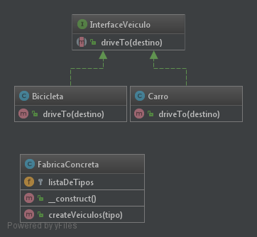

# Simple Factory

## Definição

O SimpleFactory é considerado um padrão de projeto já que é uma excelente prática de projeto!
Chega, eu disse, chega de sair por ai colocando um monte de "news" no seu projeto, largue isso. 
Agora você define uma fábrica de objetos e fica feliz da vida sabendo que seu código terá apenas 
um ponto de alteração! Lembre-se... Encapusle o que varia, sua classe deve estar aberta para extensão
mas FECHADA para modificação. Agora vá lá bichão, você é um gigante da industria agora, tem sua própria 
fabrica de objetos!!

## Diagrama UML

